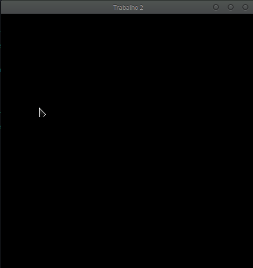

# Trabalho 2 - Ponto em polígono PyOpenGL

No trabalho, usamos Python 2.7 e a biblioteca PyOpenGL

Como não queremos ter de instalar dependências, utilizamos o virtualenv para criar um 
ambinte virtual para no trabalho e pip para gerenciar as dependências. 

Um passo a passo para rodar o projeto é

> $ pip install virtualenv

> $ virtualenv env -p python2.7

> $ source env/bin/activate

> $ pip install requirements.txt

> $ python main.py

